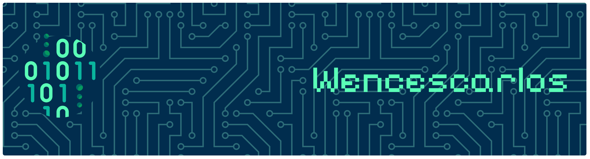

  

  

<h1 align="center">Hola, soy Wencescarlos</h1>

  Desarrollo soluciones que conectan electronica, impresion 3D, fabricacion digital, sistemas embebidos, redes, infraestructura y software.

  Arduino | ESP32 | Impresion 3D | CAD | Redes e infraestructura | Ciberseguridad | Herramientas a medida

## Sobre mí

Diseno e implemento soluciones eficientes, mantenibles y bien estructuradas, con especial interes en la integracion entre hardware y software, la optimizacion del rendimiento y la calidad del codigo.

Trabajo en proyectos de electronica, sistemas embebidos, impresion 3D, CAD, redes, infraestructura y software. Me enfoco en construir bases solidas, componentes reutilizables y sistemas que escalen sin perder mantenibilidad.

Me interesan especialmente los proyectos donde el software no se queda solo en pantalla: dispositivos conectados, automatizacion, fabricacion digital, virtualizacion y seguridad aplicada a entornos reales.

## En que trabajo

- Proyectos con Arduino, ESP32 y sistemas embebidos.
- Diseno, fabricacion y modelado 3D (impresoras y piezas funcionales).
- Integracion de hardware con APIs, paneles y automatizaciones.
- Redes, infraestructura, virtualizacion y ciberseguridad aplicada.
- Desarrollo de software modular, mantenible y orientado a problemas reales.

## Conecta conmigo

  
  

## Tecnologias y herramientas

### Embebidos y electronica

  
  
  
  
  

### Fabricacion digital y 3D

  
  
  
  

### Software y backend

  
  
  
  

### Redes, infraestructura y seguridad

  
  
  
  
  
  
  
  

## Enfoque tecnico

- Firmware y logica de control para dispositivos.
- Integracion de dispositivos, servicios y APIs.
- Redes, segmentacion e infraestructura en Linux, Windows y macOS.
- Automatizacion orientada a resolver problemas concretos con codigo claro y mantenible.

## Actividad en GitHub

Una vista rapida de mi actividad, contribuciones y ritmo de trabajo en GitHub.

  
  

  

